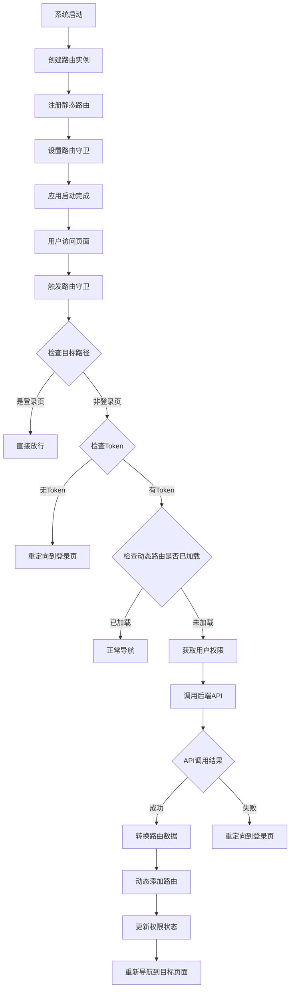
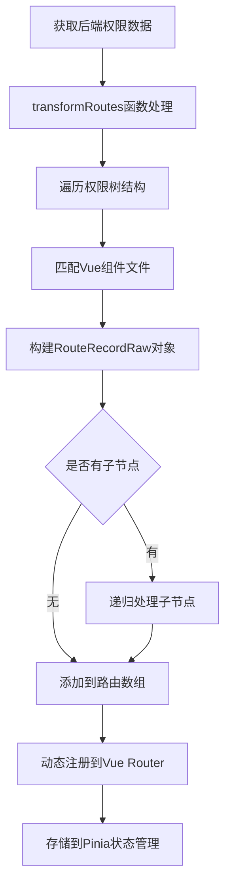

# 后台管理系统路由架构

## 1. 功能概述

### 1.1 核心功能和目标

**系统定位：** 这是一个基于Vue 3 + Vue Router 4 + Pinia的后台管理系统路由架构，采用了**动态路由**与**权限控制**相结合的设计模式。

**核心功能：**

- ✅ **动态路由生成**：根据用户权限从后端获取可访问的菜单路由
- ✅ **权限控制**：基于Token认证和角色权限的访问控制
- ✅ **路由守卫**：完整的导航前置守卫机制
- ✅ **状态管理**：使用Pinia管理路由状态和用户权限信息
- ✅ **错误处理**：404、403等错误页面处理

### 1.2 主要技术特点

- **混合路由模式**：静态路由 + 动态路由
- **基于角色的访问控制（RBAC）**
- **组件懒加载**：提升首屏加载性能
- **状态持久化**：权限信息状态管理
- **Loading优化**：路由切换时的加载状态提示

---

## 2. 技术实现详解

### 2.1 代码结构和组织方式

#### 2.1.1 目录结构
```
src/router/
├── index.ts      # 路由主配置文件，包含路由实例创建和守卫逻辑
└── routes.ts     # 静态路由定义文件

src/store/
├── permission.ts # 权限状态管理
└── mineInfo.ts   # 用户信息状态管理
```

#### 2.1.2 核心模块分析

**路由主文件 (`src/router/index.ts`)：**
```typescript
const router = createRouter({
  history: createWebHashHistory(),
  routes: constantRoute
});
```

**静态路由配置 (`src/router/routes.ts`)：**
```typescript
export const constantRoute = [
  {
    path: '/',
    redirect: '/main'
  },
  {
    path: '/home',
    component: () => import('@/views/home/index.vue'),
    name: 'home',
    children: [
      {
        path: '/main',
        component: () => import('@/views/home/main.vue'),
        name: 'main',
        meta: {
          title: '首页'
        }
      }
    ]
  },
  // ... 其他静态路由
];
```

### 2.2 使用的设计模式

#### 2.2.1 工厂模式（Factory Pattern）
动态路由转换函数使用了工厂模式：
```typescript
// 匹配views里面所有的.vue文件
const views = import.meta.glob('@/views/**/*.vue');
function transformRoutes (backendRoutes: PermissionTreeVO[]): RouteRecordRaw[] {
  const res: RouteRecordRaw[] = [];
  backendRoutes.forEach((route) => {
    const normalizedPath  =  route.component;
    // 匹配预加载的组件
    const componentPath = Object.keys(views).find(key  =>
      key.includes(`${normalizedPath}.vue`)
    ) || '';
    const r: RouteRecordRaw = {
      path: route.path,
      name: route.name,
      component: views[componentPath],
      meta: {
        title: route.title
      },
      children: []
    };
    // 若有 children，则继续递归
    if (route.children && route.children.length) {
      r.children = transformRoutes(route.children);
    }
    res.push(r);
  });
  return res;
}
```

#### 2.2.2 观察者模式（Observer Pattern）
使用Pinia状态管理实现观察者模式：
```typescript
export const usePermissionStore = defineStore('permission', {
  state: () => ({
    // 标记路由是否添加
    isRoutesAdded: false,
    dynamicRoutes: [] as RouteRecordRaw[],
    tree: [] as PermissionTreeVO[]
  }),
  actions: {
    setRoutes (routes: RouteRecordRaw[]) {
      this.dynamicRoutes = routes;
    },
    setTree (list: PermissionTreeVO[]) {
      this.tree = list;
    },
    setRoutesAdded (status: boolean) {
      this.isRoutesAdded  = status;
    },
    reset () {
      this.$reset();
    }
  }
});
```

#### 2.2.3 策略模式（Strategy Pattern）
路由守卫中的多种认证策略：
```typescript
router.beforeEach(async (to, from, next) => {
  const permissionStore = usePermissionStore();
  const token = getAccessToken();
  
  // 🧤 保护 login 页面不再获取权限路由
  if (to.path === '/login') {
    next();
    return;
  }

  if (token && !permissionStore.isRoutesAdded) {
    // 动态路由添加策略
    try {
      showLoading("正在加载系统资源...",10000);
      const backendRoutes = await getMinePermissionTree();
      const r = backendRoutes.result ? backendRoutes.result : [];
      const newRoutes = transformRoutes(r);
      
      // 动态添加路由
      newRoutes.forEach((route) => {
        router.addRoute('home', route);
      });
      
      // 存储到 Pinia
      permissionStore.setRoutes(newRoutes);
      permissionStore.setTree(r);
      permissionStore.setRoutesAdded(true);
      closeLoading();
      next(to.fullPath);
      return;
    } catch (error) {
      closeLoading();
      console.error('获取路由失败：', error);
      next('/login');
      return;
    }
  }
  
  // 未登录，或 token 不存在
  if (!token && to.path  !== '/login') {
    next('/login');
    return;
  }

  next();
});
```

### 2.3 异常处理机制

#### 2.3.1 路由级异常处理
```typescript
{
  path: '/403',
  component: () => import('@/views/error/403.vue'),
  name: '403'
},
{
  path: '/:pathMatch(.*)*',
  component: () => import('@/views/error/404.vue'),
  name: '404'
}
```

#### 2.3.2 权限获取异常处理
```typescript
} catch (error) {
  closeLoading();
  console.error('获取路由失败：', error);
  next('/login');
  return;
}
```

### 2.4 性能考虑点

#### 2.4.1 组件懒加载
```typescript
// 匹配views里面所有的.vue文件
const views = import.meta.glob('@/views/**/*.vue');
```

#### 2.4.2 路由缓存机制
通过`isRoutesAdded`标志避免重复加载：
```typescript
if (token && !permissionStore.isRoutesAdded) {
  // 如果尚未添加动态路由，则获取后端菜单并动态添加
```

#### 2.4.3 Loading状态优化
```typescript
showLoading("正在加载系统资源...",10000);
```

---

## 3. 业务流程分析

### 3.1 完整的业务处理流程

#### 3.1.1 系统初始化流程



#### 3.1.2 动态路由生成流程



### 3.2 关键业务规则说明

#### 3.2.1 权限数据结构

**权限树节点定义：**
```typescript
export interface PermissionTreeVO {
  /** 节点ID */
  id: number;
  /** 父节点ID */
  parentId?: number;
  /** 层级深度 */
  level: number;
  /** 权限显示名称 */
  title: string;
  /** 权限标识字符串 */
  permissionStr?: string;
  /** 路由名称（对应vue-router的name） */
  name: string;
  /** 路由路径（对应vue-router的path）*/
  path: string;
  /** 路由组件路径（对应vue-router的component）*/
  component?: string;
  createTime?: string;
  /** 排序权重 */
  sort: number;
  icon?: string;
  /** 子节点列表 */
  children?: PermissionTreeVO[];
}
```

#### 3.2.2 路由访问控制规则

1. **登录页面保护**：`/login`路径无需权限验证，直接放行
2. **Token验证**：所有非登录页面必须验证Token有效性
3. **动态路由懒加载**：仅在Token有效且路由未加载时获取权限
4. **权限失效处理**：API调用失败时自动重定向到登录页
5. **404处理**：使用通配符路由处理不存在的页面

#### 3.2.3 状态管理规则

**权限状态管理：**
- `isRoutesAdded`：防止重复加载动态路由
- `dynamicRoutes`：存储动态生成的路由配置
- `tree`：存储后端返回的权限树结构

**用户信息管理：**
```typescript
export const useMineInfoStore = defineStore('mineInfo', {
  state: () => ({
    mine: defaultInfo
  }),
  actions: {
    setMineInfo (mine: AdminInfo) {
      this.mine  = mine;
    },
    reset () {
      this.$reset();
    }
  }
});
```

### 3.3 数据流转过程

#### 3.3.1 权限数据流转链路

1. **后端API** → `getMinePermissionTree()` → **权限树数据**
2. **权限树数据** → `transformRoutes()` → **Vue Router配置**
3. **Vue Router配置** → `router.addRoute()` → **动态路由注册**
4. **动态路由** → `permissionStore.setRoutes()` → **状态持久化**

#### 3.3.2 用户认证数据流

1. **Token获取** → `getAccessToken()` → **认证状态检查**
2. **认证失败** → `removeToken()` → **清理状态** → **重定向登录**
3. **登出操作** → `logout()` → **状态重置** → **路由跳转**

---

## 4. 任务总结

### ✅ 功能完成度分析

- **✅ 核心功能完备**：动态路由、权限控制、状态管理全部实现
- **✅ 技术架构合理**：采用现代Vue 3生态，设计模式运用得当
- **✅ 异常处理完善**：具备完整的错误处理和降级机制
- **✅ 性能优化到位**：组件懒加载、路由缓存、Loading优化

### 🔧 技术亮点

1. **动态路由机制**：基于权限的路由动态生成，实现了灵活的权限控制
2. **状态管理设计**：使用Pinia实现了清晰的状态管理架构
3. **路由守卫策略**：多层次的路由保护机制，确保系统安全性
4. **组件预加载**：使用`import.meta.glob`实现高效的组件懒加载

### 📈 业务价值

- **权限灵活性**：支持基于角色的动态权限控制
- **用户体验**：Loading状态、错误页面提升用户体验
- **系统安全性**：完善的认证和授权机制
- **维护性**：清晰的代码结构和状态管理，便于维护和扩展

---

## 相关文件

- `src/router/index.ts` - 路由主配置文件
- `src/router/routes.ts` - 静态路由定义
- `src/store/permission.ts` - 权限状态管理
- `src/store/mineInfo.ts` - 用户信息状态管理
- `src/api/permission/` - 权限相关API
- `src/utils/auth.ts` - 认证工具函数
- `src/utils/request.ts` - HTTP请求拦截器


**系统版本：** Vue 3 + Vue Router 4 + Pinia

**分析说明：** 这是一个设计良好的后台管理系统路由架构，在权限控制、性能优化、用户体验等方面都有很好的实现。 